# GUIA DO UPLOADER EFICIENTE

Um oferecimento de [t.me/PolemicKnowledge](t.me/PolemicKnowledge)

Versão 2.0

Sumário

1. Preparando o Ambiente
    1. ffmpeg
    1. anaconda 
1. Preparando os Utilitários
1. Como Utilizar os Utilitários e Upar Vídeos de Maneira Eficiente
    1. ETAPA 1
    1. ETAPA 2
    1. ETAPA 3
    1. ETAPA 4
    1. ETAPA 5
1. Detalhes Finais


## Importante

Nenhum dos softwares utilizados nesse tutorial possui relação direta como o objetivo dos apps.

O uso dos softwares em conjunto é uma decisão individual e livre de responsabilidade dos usuários.

## 1 preparando o ambiente

Para começar, é necessário instalar alguns programas que são dependências para que os utilitários funcionem, são eles o ffmpeg e o anaconda.

### 1.1 ffmpeg

Para instalar o ffmpeg, basta ir em [https://ffmpeg.org/download.html](https://ffmpeg.org/download.html), 
No campo “get packages & executable files” clicar no botão que representa o Windows. Logo em seguida, escolheremos a opção “Windows builds from gyan.dev”, de lá, é só clicar no link [https://www.gyan.dev/ffmpeg/builds/ffmpeg-git-full.7z](https://www.gyan.dev/ffmpeg/builds/ffmpeg-git-full.7z) (também é possível simplesmente usar esse link) para baixar a versão completa e atualizada do programa.

Agora uma pasta no disco local C deve ser criada com o nome de ffmpeg. O conteúdo baixado deve ser extraído para essa pasta, caso dentro do zip tenha uma pasta só com outras pastas dentro, é o conteúdo de dentro desta que deve ser extraído para a pasta criada no disco local C.

Depois é necessário buscar na busca do Windows por “editar as variáveis de ambiente do sistema” será aberto esse menu, e nele é só acessar o submenu “Variáveis de ambiente”:


Será aberto esse menu, onde deve ser adicionado um novo caminho, clicando na linha “PATH” e depois clicando em “editar” (o que abrirá outra janela):

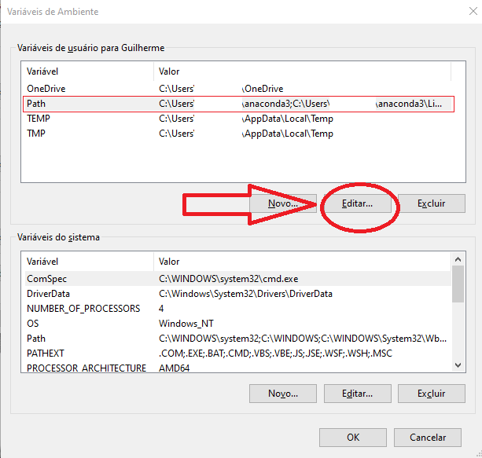

Na nova janela aberta é só clicar em “novo” e adicionar o caminho da pasta “bin” do ffmpeg. Essa pasta está dentro da primeira pasta criada no disco local C.

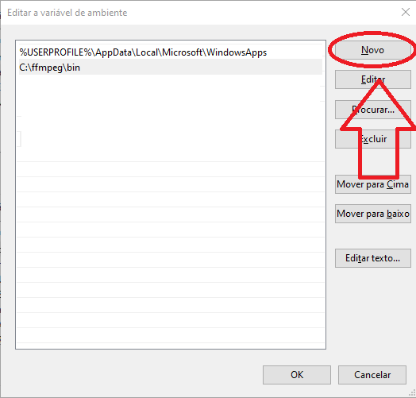

Logo após adicionar o novo caminho, afim de evitar erros, é interessante selecionas o novo caminho adicionado e clicar em “mover para cima”. Isso fará com que este tenha prioridade com relação ao caminho que já estava presente na lista.

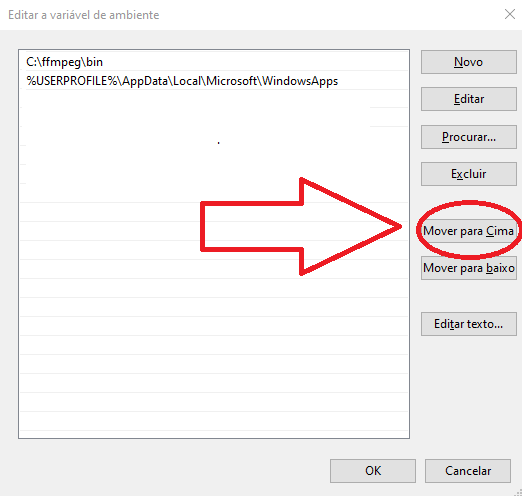

Para verificar se está tudo funcionando, basta abrir o cmd do Windows e digitar “ffmpeg”. Caso esteja tudo certo, o resultado será como o abaixo:

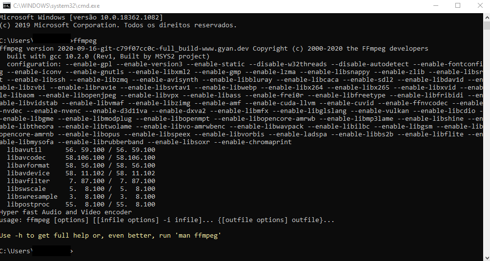


### 1.2 anaconda

Esse é mais simples: basta ir em [https://www.anaconda.com/products/individual](https://www.anaconda.com/products/individual) e clicar em download, depois é só baixar a versão apropriada para a sua arquitetura (64 ou 32 bits).  Depois é só executar o .exe baixado. A instalação não possui detalhes, a não o de que é necessário marcar a opção em destaque abaixo, a outra caixa é opcional. A instalação pode demorar um pouco, mas isso é normal.

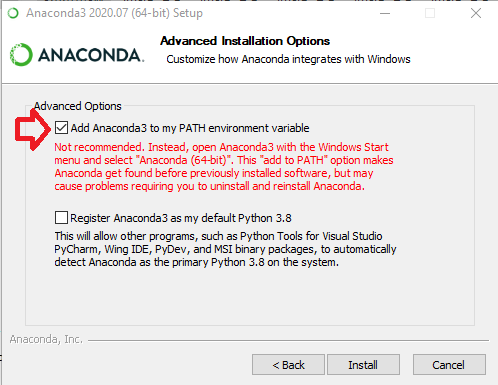

## 2 preparando os utilitários

Para começar, é só baixar os utilitários nos seguintes links:

1. Mass Video Join: [https://github.com/apenasrr/mass_videojoin](https://github.com/apenasrr/mass_videojoin)
2. Time Stamp Link Maker: [https://github.com/apenasrr/timestamp_link_maker](https://github.com/apenasrr/timestamp_link_makerj)
3. Zipind: [https://github.com/apenasrr/zipind](https://www.google.com/url?q=https://github.com/apenasrr/zipind&sa=D&ust=1608417945410000&usg=AOvVaw22EBq1e5Hj2e1qtxo5p8lj)
4.  Telegram_filesender: [https://github.com/apenasrr/Telegram_filesender](https://github.com/apenasrr/Telegram_filesender)
5.  Zimatise: [https://github.com/apenasrr/zimatise](https://github.com/apenasrr/zimatise)


Para baixar qualquer um desses, basta clicar no botão “code” e, em seguida, clicar em “Download ZIP”.

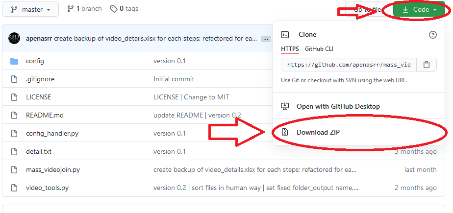

Agora, basta extrair os utilitários, todos numa mesma pasta. Garanta de que as extensões de arquivo estão sendo exibidas indo no menu “Exibir” e então marcando a caixa “Extensões de nomes de arquivos”.


ATENÇÃO: OS PASSOS A SEGUIR DEVEM SER REPETIDOS EM TODOS OS UTILITÁRIOS.

Agora é preciso instalar as dependências de cada utilitário, para isso, basta executar o arquivo “upadete_libs.bat” dentro de cada pasta:

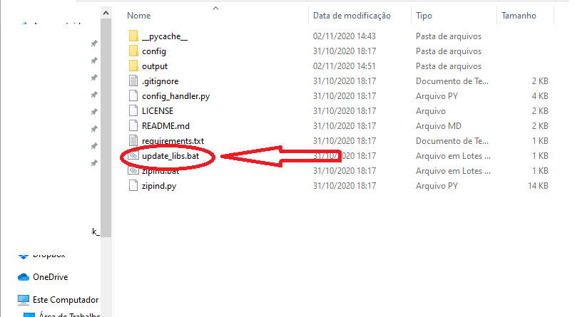

Agora, renomeie as pastas, tirando o “-master” do nome cada uma, o resultado final deve ser esse:

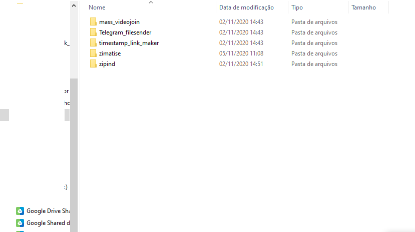

Por último, basta fazer uma última configuração no timestamp_link_maker: vá até a pasta e altere os textos dos arquivos “summary_bot” e “summary_top”:

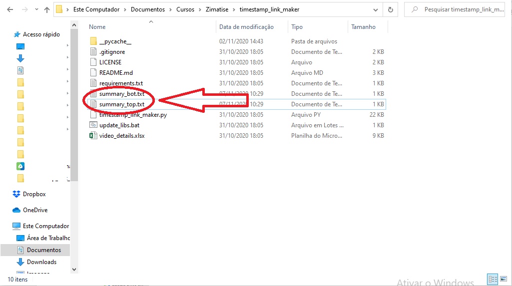

No arquivo “summary_bot”, troque o texto que está lá por esse:

```
Bons estudos!

Não se esqueça de checar os nossos outros cursos:

@PolemicKnowledge
```
O resultado será como na imagem:

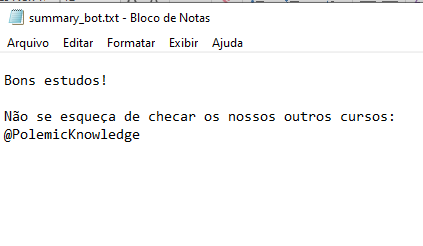

No arquivo “summary_top”, troque o texto que está no arquivo por esse:

```
⚠ Atenção ⚠

Clique aqui para ver o Menu de navegação.
Utilize as # para navegar rapidamente entre os blocos de vídeos.


Materiais em #Materiais
```

O resultado será como na imagem:

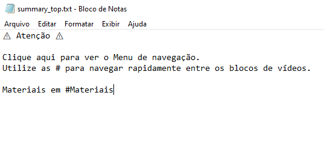

## 3 como utilizar os utilitários e upar vídeos de maneira eficiente

### 3.1 ETAPA 1

Agora que todas as ferramentas estão prontas, é hora de usá-las.

Comece indo na pasta do zimatise e execute o arquivo “zimatise.bat”, será aberta uma janela do cmd com um menu simples. Para começar, é ideal compactar quaisquer arquivos que não sejam de vídeo de dentro da pasta do curso. Para isso, basta digitar 1 e apertar enter:

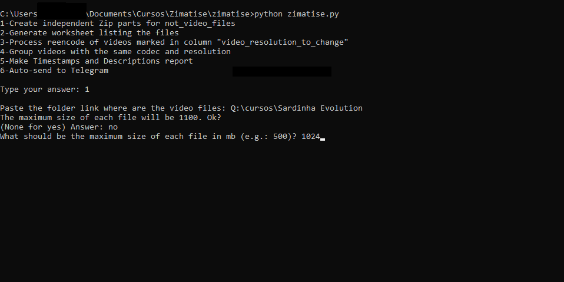

AVISO: Lembre-se de apertar enter após informar cada uma das informações em todas as etapas.

Informe a pasta raiz do curso. O programa perguntará se o tamanho usado pela última vez deve ser utilizado, caso não seja digite “no”, informe o novo tamanho (em mb) e aguarde o processo de listagem. Se o tamanho informado for desejado, pasta aperta enter sem digitar nada. O processo de compactação será como na próxima imagem:

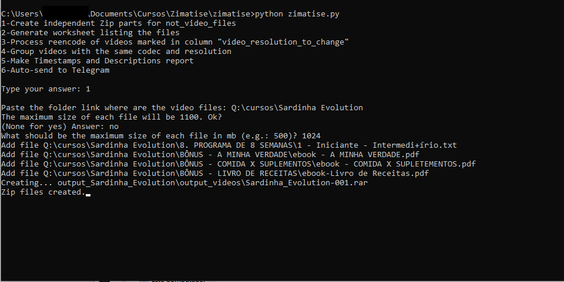

### 3.2 ETAPA 2

Agora é necessário gerar uma listagem dos arquivos a serem padronizados e juntados em blocos. Para isso, basta selecionar a segunda opção digitando 2\. Informe a pasta da raiz do curso novamente e aguarde o processo de listagem:

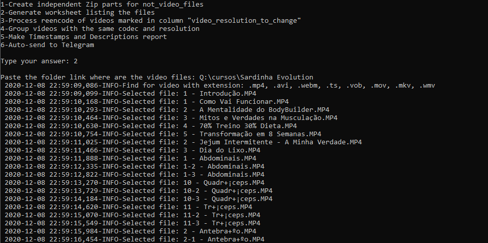

Após a conclusão do processo o utilitário informará os codecs e resoluções presentes nos vídeos da pasta e escolherá o conjunto mais presente para ser o alvo de conversão dos outros vídeos presentes nas subpastas e na pasta raiz:

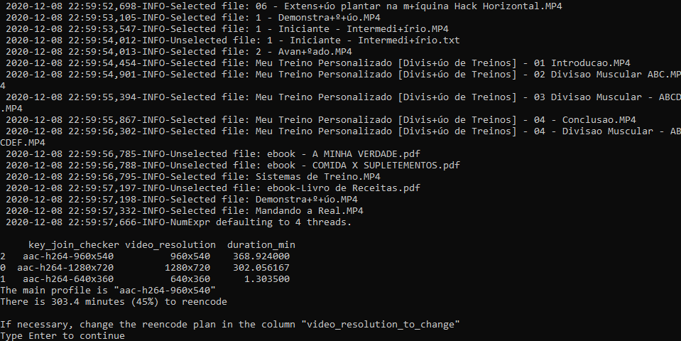

ATENÇÃO: FAÇA A PRÓXIMA ETAPA MESMO QUE QUE A ANTERIOR NÃO APONTE QUE SEJA NECESSÁRIO FAZER ALGUMA ALTERAÇÃO, POIS NO PRÓXIMO PASSO TAMBÉM SÃO GERADOS METADADOS IMPORTANTES PARA A SUÍTE!

### 3.3 ETAPA 3

O próximo passo é reencodar os vídeos, para que estes fiquem todos no mesmo padrão. Para tal, basta escolher a terceira opção e aguardar a conclusão do processo.

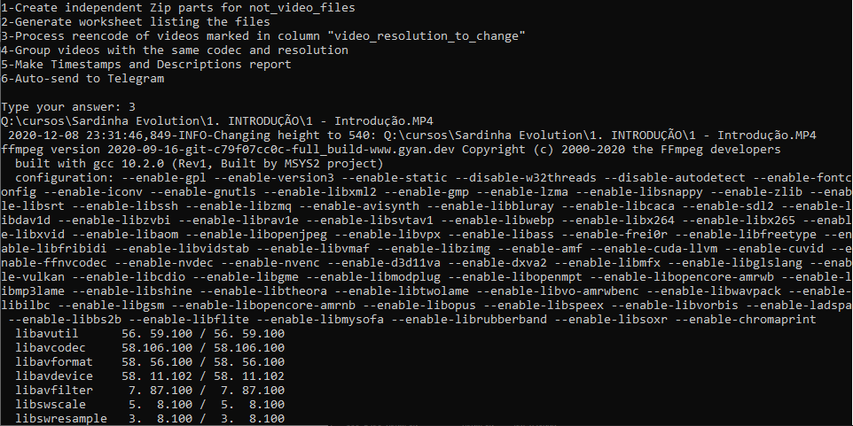

Após o final da padronização, o resultado será como o da imagem a seguir:

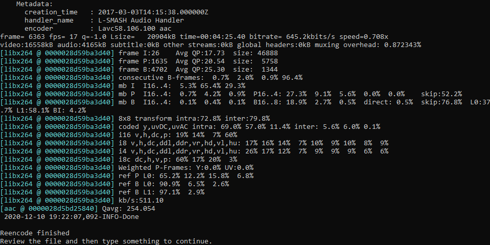

### 3.4 ETAPA 4

A próxima etapa consiste em agrupar vídeos que possuam o mesmo codec e resolução. Para isso, basta selecionar a quarta opção, caso o tamanho (em mb) informado seja o desejado, apenas aperte enter, caso não seja, digite “no”, aperte enter e informe o tamanho desejado para os blocos:

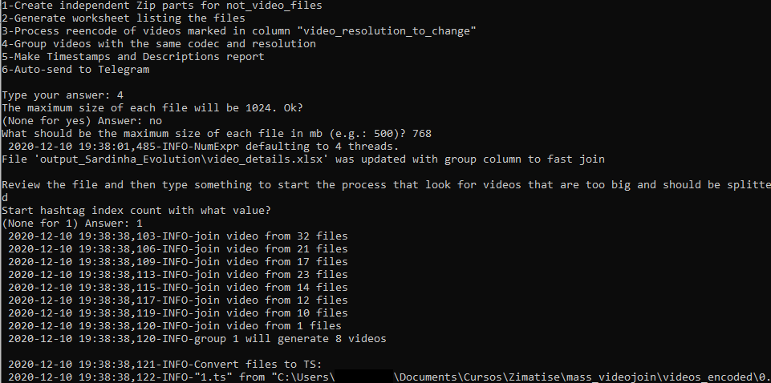

### 3.5 ETAPA 5

Na penúltima etapa é gerada a planilha com as descrições dos blocos (que contém quais vídeos estão em cada uma) e a descrição que contém a navegação para cada bloco. Selecione 5, depois escolha por onde começará a contagem, caso queira começar do número 1, apenas prossiga apertando enter, caso queira mudar, informe o valor em um número inteiro e aperte enter.

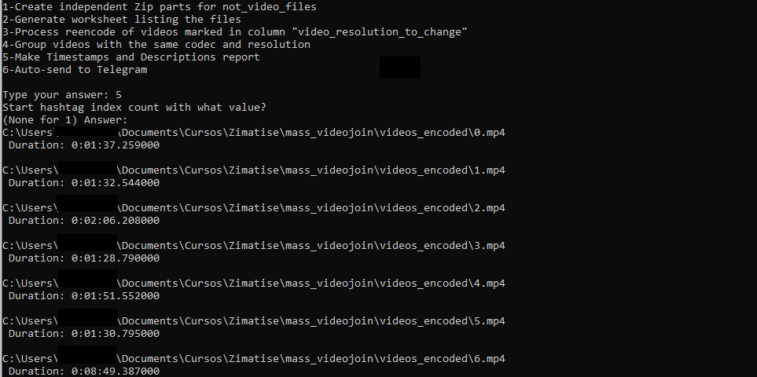

#### 3.5.1 ETAPA 5 – Corrigindo as descrições


A planilha gerada será como a seguinte:

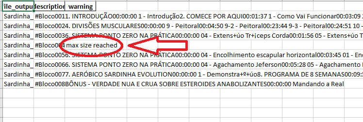

A parte destaca em vermelho indica que a descrição foi criada, porém ultrapassou o limite de 1000 caracteres (contando com espaços). Descrições assim devem ser alteradas para que funcionem apropriadamente. Clicando duas vezes na célula da descrição com problemas, ela se expandirá e será possível copiar o texto e colá-lo em um editor de texto (para fechar a célula, basta apertar esc), ou ainda alterar no próprio Excel. Nesse tutorial será utilizado o Word para ajeitar as descrições.

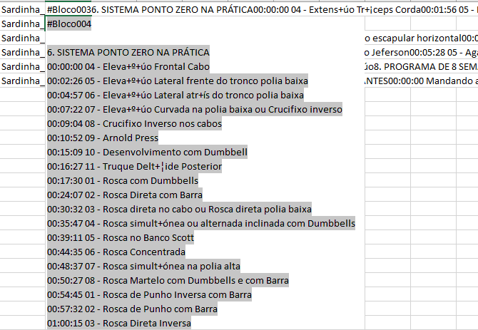

Usando a contagem de caracteres do Word é possível ver quantos caracteres existem no documento, e, por conseguinte, quantos deverão ser cortados:

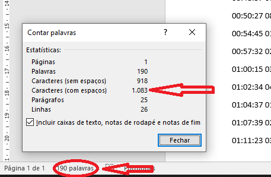

Uma função muito útil do Word para correção de textos é a de substituição, eis um exemplo de uso:

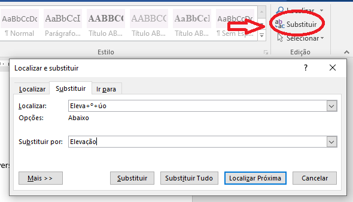

Depois que a descrição estiver com 1000 caracteres ou menos, basta copiá-la e cola-la na célula do Excel de onde ela foi originalmente copiada. Caso vá fazer o processo de upload manual, não é necessário fazer a substituição no Excel, pois é possível só copiar os textos corrigidos no Word. Também é importante corrigir erros de digitação e caracteres bugados em todas as descrições, e não só alterar aquelas que estejam acima do limite.

#### 3.5.1 ETAPA 5 – Fazendo o Upload

Primeiro deve ser feito um novo canal no Telegram. O canal deve OBRIGATORIAMENTE ter o nome oficial do curso, uma foto da logo do curso (caso o curso seja da udemy, utilize a thumb do vídeo de apresentação. Caso não encontre nada, consulte o resto da equipe). Na descrição (por enquanto) coloque a assinatura da Polemic ou o @ do canal principal.

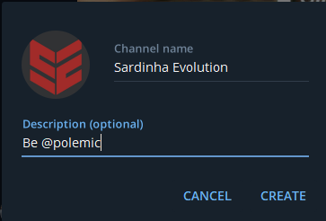

Coloque o canal como privado e, clicando no link com o botão esquerdo ou direito do mouse, copie o link do canal.

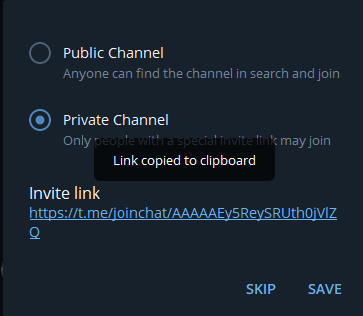

O aplicativo dará a opção de adicionar pessoas para o seu canal (como seguidores). Apenas pule essa etapa ou adicione alguém da equipe que esteja num nível acima do seu (converse com a equipe e defina isso de antemão).

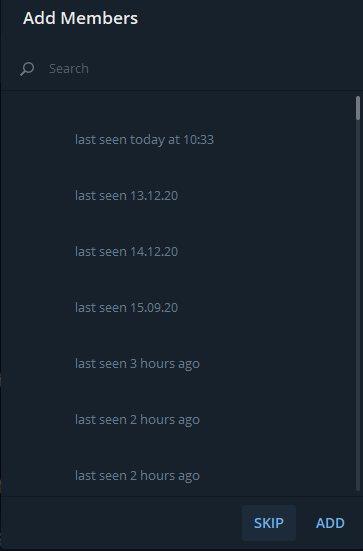

Agora é necessário editar o resto da descrição do canal: comece clicando nos três pontos no canto superior direito do quadro de visualização do canal, vá em “gerenciar canal”.

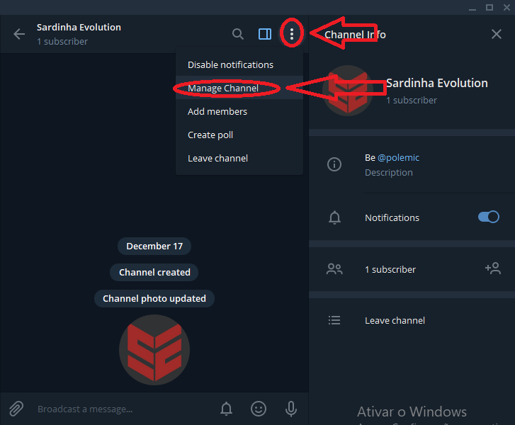

A descrição deve conter o link do canal, coloque-o acima da assinatura com o prefixo “Link desse canal: ”, ou algo de cunho similar (caso pretenda mudar, avise a algum membro superior a você). Agora devem ser preenchidos os metadados do curso. Vá na pasta com os vídeos do curso, a pasta estará dentro da pasta do curso, que por sua vez estará dentro da pasta do zimatise. Selecione todos os vídeos, clique com o botão direito e clique em “propriedades”.

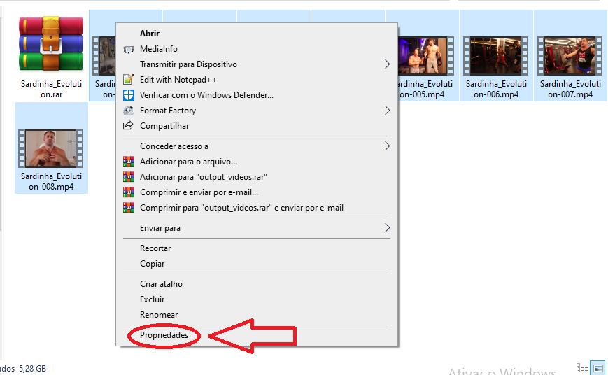

Será aberta uma janela. Nessa nova janela, na aba “geral”, copie o tamanho dos vídeos e coloque na descrição do canal, acima do link do mesmo. Depois, na aba “detalhes”, copie a duração total dos vídeos e também coloque na descrição do canal. A duração dos vídeos estará num bloco chamado “Vídeo”, na linha “Comprimento”. A duração deve estar no formato “XXh XXmin XXseg”

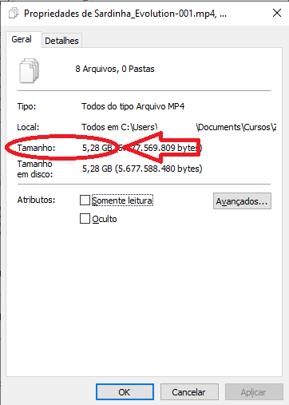

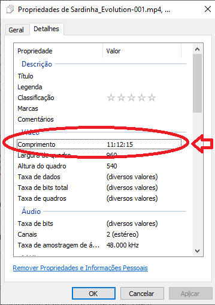

Após essas alterações, a descrição do canal deve ficar como o exemplo abaixo:

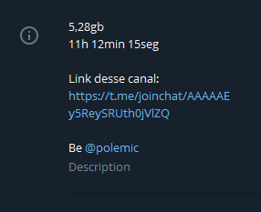

O upload automático precisa de um pequeno preparo para funcionar: comece abrindo a pasta do curso a ser upado e selecione o primeiro arquivo de vídeo.

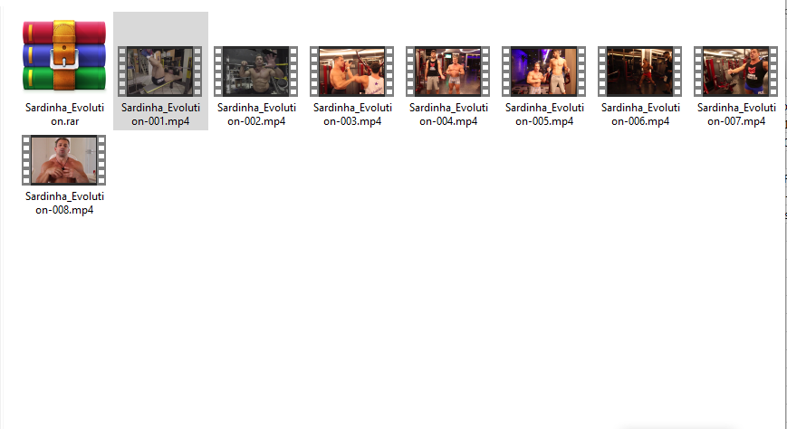

Agora siga os passos abaixo nesta exata ordem:
1. Deixe a janela da pasta dos vídeos aberta
2. Depois abra a janela do Telegram 
3. Depois abra a janela do Zimatise
4. Faça isso utilizando o comando alt + tab, para evitar que a seleção do vídeo se perca. Caso não faça desta forma, há grande risco da automação gerar erros.
5. Na janela do zimatise, digite 6 e tecle [enter]
6. Nas opções que se exibirão, tecle [enter]

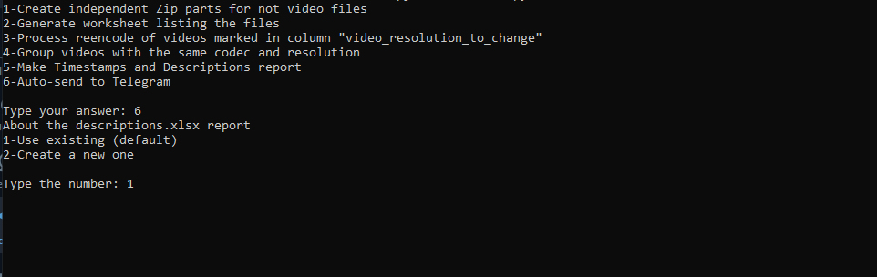

Quando o processo automático terminar, faça o upload dos materiais, trata-se do arquivo .zip na pasta onde estão os vídeos. Poste-os com #Materiais na descrição. Não há problemas em fazer o upload dos materiais antes de upar os vídeos.

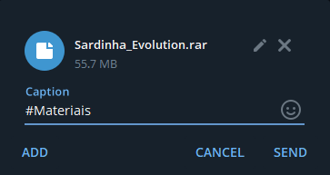

Caso prefira fazer o upload manualmente, apenas arraste os vídeos para a janela do Telegram ou use o clipe de papel no canto inferior esqueto do quadro do canal, copie e cole as descrições na tabela “descriptions.xlsx” e repita o processo para todos os blocos, na ordem correta.

# Detalhes finais

1. O resultado final do tutorial pode ser checado aqui: [https://t.me/joinchat/AAAAAFN6ZXVSxD6JKsbCkg](https://t.me/joinchat/AAAAAFN6ZXVSxD6JKsbCkg)
