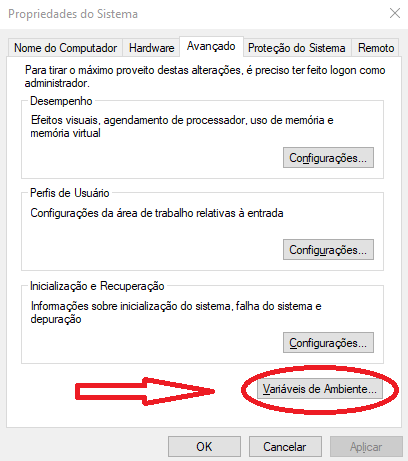

# GUIA DO UPLOADER EFICIENTE

Um oferecimento de [t.me/PolemicKnowledge](t.me/PolemicKnowledge)

Versão v100

## Sumário

1. Preparando o Ambiente
    1. ffmpeg
    1. anaconda
1. Preparando os Utilitários
1. Como Utilizar os Utilitários e Upar Vídeos de Maneira Eficiente
    1. ETAPA 1
    1. ETAPA 2
    1. ETAPA 3
    1. ETAPA 4
    1. ETAPA 5
1. Detalhes Finais


## Importante

Nenhum dos softwares utilizados nesse tutorial possui relação direta como o objetivo deste tutorial.

O uso dos softwares em conjunto para qualquer objetivo, é por uma decisão individual de responsabilidade de cada usuário.

## 1 preparando o ambiente

Para começar, é necessário instalar alguns programas que são dependências para que os utilitários funcionem, são eles o ffmpeg e o anaconda.

### 1.1 ffmpeg

O ffmpeg é uma "caixa de ferramenta" que pode ser utilizada via linha de comando por qualquer linguagem de programação para fazer dezenas de operações com arquivos áudio, vídeo e legendas, incluindo transformar vídeos (codecs, resolução, bitrate) e extrair quaisquer informações (metadados) sobre esses arquivos.

#### Para obter o ffmpeg:
- Baixe a partir deste [link direto]((https://www.gyan.dev/ffmpeg/builds/ffmpeg-git-full.7z)), que contém a versão completa e atualizada do programa. Ou siga os passos abaixo.
- Acesse [https://ffmpeg.org/download.html](https://ffmpeg.org/download.html).
- No campo “get packages & executable files”, clique no botão que representa o Windows.
- Logo em seguida, escolha a opção `Windows builds from gyan.dev`
- Em seguida clique no link `https://www.gyan.dev/ffmpeg/builds/ffmpeg-git-full.7z`

#### Configurando o ffmpeg:
- Felizmente o ffmpeg não se instala, sendo uma aplicação portátil (portable). É necessário apenas o configurar para que seja possível o utilizar por terminal a partir de qualquer local ou pasta do PC.
- Escolha um diretório e crie uma pasta com o nome `ffmpeg`.
- O arquivo baixado deve ser extraído nesta pasta vazia que foi criada.
- Para o ffmpeg ser acessável via terminal a partir de qualquer local do seu sistema, busque o termo `variáveis de ambiente` na ferramenta de busca do windows e acesse  a aplicação `editar as variáveis de ambiente do sistema`.
- Na aplicação que será aberta, acesse a guia `Avançado` e clique no botão `Variáveis de Ambiente`.



- No form "Variáveis de Ambiente", clique no nome `Path` na coluna `Variável`. Em seguida clique no botão `Editar`.


- No form "Editar a variável de ambiente", clique no botão "Novo" e adicione o caminho da pasta `bin` que existe dentro da pasta criada para o ffmpeg.
- Caso se tenha criado a pasta na "unidade C", a pasta `bin` estará no caminho: `C:\ffmpeg\bin`


- Para evitar erros, logo após adicionar o novo caminho, selecione o novo caminho adicionado, em seguida clique no botão `Mover para Cima`.
- Esta ação dará ao path criado, maior prioridade em relação aos demais paths da lista.


- Parabéns. O ffmpeg foi configurado como variável de sistema!
- Para verificar se está tudo funcionando bem, basta abrir o cmd do Windows: (`[ctrl]+[r], cmd, [enter]`)
- Em seguida digite `ffmpeg` no terminal aberto e tecle `[Enter]`. O resultado deve ser similar a imagem abaixo.


### 1.2 anaconda
Anaconda é uma 'distribuição python' que funciona como pacote que instala a linguagem de programação Python, diversas libs de ciência de dados e outras coisas úteis.
Diferentemente de enfrentar o trabalho de instalar cada pedaço separado, a instação do Anaconda automatiza o serviço e poupa bastante tempo.

#### Para obter o anaconda:
* Acesse [https://www.anaconda.com/products/individual](https://www.anaconda.com/products/individual)
* Clique em download
* Baixe a versão apropriada para a sua arquitetura (64 ou 32 bits)
* Execute o .exe baixado.
* No form 'Advanced Options', marque `Add anaconda3 to my PATH environment variable`. Esta função automatiza a inclusão do Python no Path do windows, dispensando a repetição do trabalho executado no tópico anterior, com o ffmpeg.
* Clique em `Install`
* A instalação pode demorar alguns minutos, mas isso é normal.


## 2 Preparação os utilitários

Baixe os utilitários nos seguintes links:

1. Mass Video Join: [https://github.com/apenasrr/mass_videojoin](https://github.com/apenasrr/mass_videojoin)
2. Time Stamp Link Maker: [https://github.com/apenasrr/timestamp_link_maker](https://github.com/apenasrr/timestamp_link_makerj)
3. Zipind: [https://github.com/apenasrr/zipind](https://www.google.com/url?q=https://github.com/apenasrr/zipind&sa=D&ust=1608417945410000&usg=AOvVaw22EBq1e5Hj2e1qtxo5p8lj)
4.  Telegram_filesender: [https://github.com/apenasrr/Telegram_filesender](https://github.com/apenasrr/Telegram_filesender)
5.  Zimatise: [https://github.com/apenasrr/zimatise](https://github.com/apenasrr/zimatise)

### Como baixar
- Clique no botão “Code” e, em seguida,
- Clique em “Download ZIP”.
- Repita o procedimento na página de cada utilitário


- Extraia todos os utilitários numa mesma pasta.
- Garanta de que as extensões de arquivo estão sendo exibidas, indo no menu “Exibir” e então marcando o checkbox “Extensões de nomes de arquivos”.


`ATENÇÃO: OS PASSOS A SEGUIR DEVEM SER REPETIDOS EM TODOS OS UTILITÁRIOS.`

### Atualizações de dependências
O python é uma linguagem de programação, onde durante a atividade de programação, vários 'atalhos' são pegos através do uso de scripts que foram criados por outras pessoas. Eses scripts são chamados de 'Libs' (bibliotecas).

Cada utilitário composto pelo Zimatise possui diversas libs requeridas, que precisamos baixar e atualizar.

Para facilitar o processo, tudo foi resumido à execução de 1 arquivo.
- Para cada pasta de utilitário, abra sua pasta e execute o arquivo `update_libs.bat`.


- Renomeie as pastas de cada utilitário, tirando o `“-master”` do nome cada uma. O resultado final deve ser esse:


```
CURIOSIDADE

O passo acima só foi necessário porque os utilitários foram baixados através do botão 'code' no site do github.
Se tivessem sido baixados por linha comando (git clone), as pastas apareceriam da forma desejada.
Para saber mais: https://docs.github.com/pt/github/creating-cloning-and-archiving-repositories/cloning-a-repository
```
### Customização do Zimatise
#### Aplicação de assinatura no sumário do canal
- Na pasta do utilitário timestamp_link_maker, os textos dos arquivos `“summary_bot.txt”` e `“summary_top.txt”` precisam ser alterados.


* No arquivo “summary_bot”, troque o texto que está lá por esse:

```
Bons estudos!

Não se esqueça de checar os nossos outros cursos:

@PolemicKnowledge
```
O resultado será como na imagem:


- No arquivo “summary_top”, troque o texto que está no arquivo por esse:

```
⚠ Atenção ⚠

Clique aqui para ver o Menu de navegação.
Utilize as # para navegar rapidamente entre os blocos de vídeos.


Materiais em #Materiais
```

- O resultado será como na imagem:


#### Seleção dos arquivos à serem compactados
Vídeos serão disponibilizados via streamming, mas demais arquivos serão compactados. Para gerar este efeito, é necessário informar ao Zimatise quais tipos de arquivos não deverão ser compactados.
- Acesse a pasta do utilitário `Zipind`
- Acesse a pasta `config`
- Abra o arquivo `ignore_extensions.txt`
- Na última linha do arquivo, adicione as extensões de vídeos que não deverão ser compactadas, tal como exemplo:
- `mp4,avi,webm,ts,vob,mov,mkv,wmv`


## 3 Como utilizar os utilitários - O segredo do Processo Automático e Upload eficiente

Agora que todas as ferramentas estão prontas, é hora de usá-las.

- Acesse a pasta do Zimatise e execute o arquivo “zimatise.bat”
- Será aberta um `terminal` com um menu simples

### 3.1 ETAPA 1 - Compactação de arquivos

- No menu de opções, escolha a primeira opção digitando `1` e confirmando ao teclar `[Enter]`


> `AVISO: Lembre-se de teclar [Enter] após digitar uma resposta em todas as etapas.`

> ATENÇÃO\
> Mova a pasta do curso para a raiz do seu HD.\
> Caso seu HD seja a unidade `C` e a pasta do curso se chame `meu_curso`, após a pasta ser movida, o caminho para ela será: `C:\meu_curso`.\
> Este processo é importante pois o arquivo compactado preserva a hierarquia das pastas, gerando um resultado  incoveniente caso o curso esteja submerso entre diversas pastas no seu PC.\
> Após a finalização do projeto, naturalmente o curso pode ser movido de volta para a pasta que o usuário achar conveniente.
- Informe o caminho da pasta raiz do curso.
- Para copiar o caminho, acesse a pasta pelo `Windows Explorer` e tecle `[ctrl]+[L], [ctrl]+[c]`
- Caso ao tentar no colar no terminal, o atalho `[ctrl]+[v]` não funcione, clique com o botão direito do mouse dentro do terminal, que o caminho será colado.

-  Na pergunta `The maximum size of each file will be... Ok?`, é informado o tamanho máximo por arquivo compactado que o script está configurado. Recomenda-se configurar como `1024`.
-  Caso não esteja com o tamanho recomendado, digite `n`, confirme e em seguida digite o tamanho máximo recomendado.
-  Na próxima vez que esta opção for utilizada, o último tamanho usado será lembrado.
-  Caso o tamanho recomendado já esteja configurado, confirme sem digitar nada adicional, teclando `[Enter]`.
-  O processo de compactação será como na próxima imagem:


### 3.2 ETAPA 2 - Gerar relatório de arquivos de vídeos

O processo dos vídeos se resume em agrupar os vídeos em grandes blocos de até 2 horas e/ou de tamnho máximo definido em megabytes.
Para gerar esse efeito, os vídeos a serem agrupados preciam ter o mesmo perfil, com o mesmo **encode de áudio, vídeo** e mesma resolução.
Para fazer esta análise e dá as instruções de transformação, siga os passos:
- Ative a segunda opção digitando `2`
- Informe o caminho da pasta do curso novamente e aguarde o processo de listagem


- Após a conclusão do processo, o utilitário informará os perfis encontrados nos vídeos da pasta e escolherá o perfil mais popular para servir de modelo de conversão, onde os demais vídeos serão marcados para serem transformados para se igualar ao perfil popular.


```
AVANÇADO
Diminuindo o tempo necessário de reencode.
- Também é possível não aceitar o plano sugerido de conversão. Onde você pode mudar o plano de conversão de modo a diminuir o tempo total de reencode sem afetar a qualidade final do projeto.
- A mudança do plano do plano de reencode é realizada no relatório `video_details.xlsx` que foi criado na pasta do projeto.
- Através da mudança ou exclusão dos valores de resolução de alguma das linhas da coluna "video_resolution_to_change".

Onde está a pasta do projeto?
- A pasta do projeto foi criada na pasta do Zimatise, com o nome: `output_{nome_da_pasta_do_curso}`.

De que forma devo alterar o plano?
- Recomenda-se que o objetivo de adaptação seja homogeneizar os perfis (transformar para terem o mesmo perfil de encode/resolução) apenas dentro de cada bloco de vídeo.
- É recomendado que um bloco de vídeo não contenha vídeo de módulos diferentes. E não é necessário que diferentes blocos de vídeos tenham perfis homogêneos para possibilitar o processo de agrupamento.
- Desta forma, basta que os vídeos de um mesmo módulo sejam homogêneos, não sendo necessário que todo o curso possua vídeos de mesmo perfil de encode/resolução, tal como será sugerido no plano automático de reencode.
```

> ATENÇÃO\
> Execute a próxima etapa mesmo que a etapa anterior aponte que não seja necessário fazer alguma alteração, pois nesta etapa também são geradas transformações importantes no relatório, essenciais para o continuar o projeto com sucesso.

### 3.3 ETAPA 3 - Reencode - Transformação de perfis

O próximo passo é reencodar os vídeos, para os vídeos que serão agrupados, fiquem com o mesmo perfil de encode/resolução.\
Este processo pode demorar entre 10% à 50% da duração total dos vídeos à serem transformados de acordo com o plano de reencode.\
Assim, se o plano de reencode contiver 10 horas de vídeos, o processo de reencode pode demorar entre 1 à 5 horas, dependendo da potência de seu processador.

- Selecione a terceira opção digitando `3` e aguarde a conclusão do processo.


- Após o final do processo de reencode, o resultado será similar ao da imagem a seguir:


### 3.4 ETAPA 4 - Agrupamento dos vídeos

A próxima etapa consiste em agrupar vídeos que possuam o mesmo codec e resolução. Para isso, basta selecionar a quarta opção, caso o tamanho (em mb) informado seja o desejado, apenas aperte enter, caso não seja, digite “no”, aperte enter e informe o tamanho desejado para os blocos:


### 3.5 ETAPA 5

Na penúltima etapa é gerada a planilha com as descrições dos blocos (que contém quais vídeos estão em cada uma) e a descrição que contém a navegação para cada bloco. Selecione 5, depois escolha por onde começará a contagem, caso queira começar do número 1, apenas prossiga apertando enter, caso queira mudar, informe o valor em um número inteiro e aperte enter.


#### 3.5.1 ETAPA 5 – Corrigindo as descrições


A planilha gerada será como a seguinte:


A parte destaca em vermelho indica que a descrição foi criada, porém ultrapassou o limite de 1000 caracteres (contando com espaços). Descrições assim devem ser alteradas para que funcionem apropriadamente. Clicando duas vezes na célula da descrição com problemas, ela se expandirá e será possível copiar o texto e colá-lo em um editor de texto (para fechar a célula, basta apertar esc), ou ainda alterar no próprio Excel. Nesse tutorial será utilizado o Word para ajeitar as descrições.


Usando a contagem de caracteres do Word é possível ver quantos caracteres existem no documento, e, por conseguinte, quantos deverão ser cortados:


Uma função muito útil do Word para correção de textos é a de substituição, eis um exemplo de uso:


Depois que a descrição estiver com 1000 caracteres ou menos, basta copiá-la e cola-la na célula do Excel de onde ela foi originalmente copiada. Caso vá fazer o processo de upload manual, não é necessário fazer a substituição no Excel, pois é possível só copiar os textos corrigidos no Word. Também é importante corrigir erros de digitação e caracteres bugados em todas as descrições, e não só alterar aquelas que estejam acima do limite.

#### 3.5.1 ETAPA 5 – Fazendo o Upload

Primeiro deve ser feito um novo canal no Telegram. O canal deve OBRIGATORIAMENTE ter o nome oficial do curso, uma foto da logo do curso (caso o curso seja da udemy, utilize a thumb do vídeo de apresentação. Caso não encontre nada, consulte o resto da equipe). Na descrição (por enquanto) coloque a assinatura da Polemic ou o @ do canal principal.


Coloque o canal como privado e, clicando no link com o botão esquerdo ou direito do mouse, copie o link do canal.


O aplicativo dará a opção de adicionar pessoas para o seu canal (como seguidores). Apenas pule essa etapa ou adicione alguém da equipe que esteja num nível acima do seu (converse com a equipe e defina isso de antemão).


Agora é necessário editar o resto da descrição do canal: comece clicando nos três pontos no canto superior direito do quadro de visualização do canal, vá em “gerenciar canal”.


A descrição deve conter o link do canal, coloque-o acima da assinatura com o prefixo “Link desse canal: ”, ou algo de cunho similar (caso pretenda mudar, avise a algum membro superior a você). Agora devem ser preenchidos os metadados do curso. Vá na pasta com os vídeos do curso, a pasta estará dentro da pasta do curso, que por sua vez estará dentro da pasta do zimatise. Selecione todos os vídeos, clique com o botão direito e clique em “propriedades”.


Será aberta uma janela. Nessa nova janela, na aba “geral”, copie o tamanho dos vídeos e coloque na descrição do canal, acima do link do mesmo. Depois, na aba “detalhes”, copie a duração total dos vídeos e também coloque na descrição do canal. A duração dos vídeos estará num bloco chamado “Vídeo”, na linha “Comprimento”. A duração deve estar no formato “XXh XXmin XXseg”


Após essas alterações, a descrição do canal deve ficar como o exemplo abaixo:


O upload automático precisa de um pequeno preparo para funcionar: comece abrindo a pasta do curso a ser upado e selecione o primeiro arquivo de vídeo.


Agora siga os passos abaixo nesta exata ordem:
1. Deixe a janela da pasta dos vídeos aberta
2. Depois abra a janela do Telegram
3. Depois abra a janela do Zimatise
4. Faça isso utilizando o comando alt + tab, para evitar que a seleção do vídeo se perca. Caso não faça desta forma, há grande risco da automação gerar erros.
5. Na janela do zimatise, digite 6 e tecle [enter]
6. Nas opções que se exibirão, tecle [enter]


Quando o processo automático terminar, faça o upload dos materiais, trata-se do arquivo .zip na pasta onde estão os vídeos. Poste-os com #Materiais na descrição. Não há problemas em fazer o upload dos materiais antes de upar os vídeos.


Caso prefira fazer o upload manualmente, apenas arraste os vídeos para a janela do Telegram ou use o clipe de papel no canto inferior esqueto do quadro do canal, copie e cole as descrições na tabela “descriptions.xlsx” e repita o processo para todos os blocos, na ordem correta.

# Detalhes finais

1. O resultado final do tutorial pode ser checado aqui: [https://t.me/joinchat/AAAAAFN6ZXVSxD6JKsbCkg](https://t.me/joinchat/AAAAAFN6ZXVSxD6JKsbCkg)
