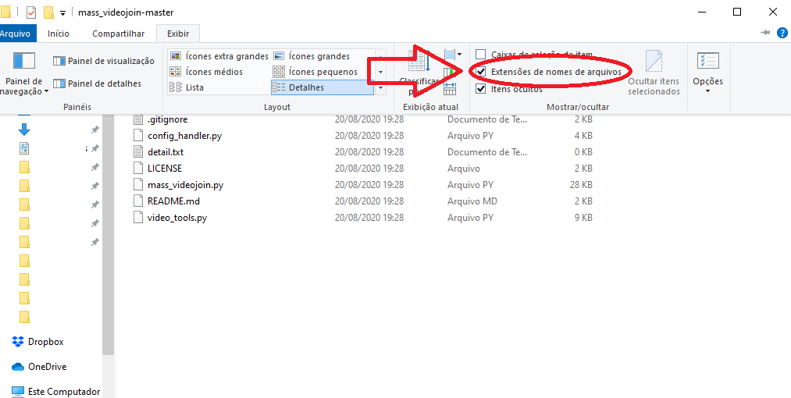
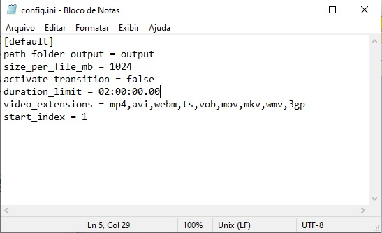

# GUIA DO UPLOADER EFICIENTE

Um oferecimento de [t.me/PolemicKnowledge](t.me/PolemicKnowledge)

Versão v104

## Sumário

1. Preparando o Ambiente
    1. ffmpeg
    1. anaconda
    1. winrar
2. Customização do Zimatise
3. Como Utilizar os Utilitários e Upar Vídeos de Maneira Eficiente
    1. ETAPA 1 - Preparando o ambiente
    2. ETAPA 2 - Gerar relatório de arquivos de vídeos
    3. ETAPA 3 - Como utilizar os utilitários - O segredo do Processo Automático e Upload eficiente
    4. ETAPA 4 - Agrupamento dos vídeos
    5. ETAPA 5 - Descrições dos vídeos e do Projeto
    6. ETAPA 6 - O Upload
4. Conclusão

## Importante

Nenhum dos softwares utilizados nesse tutorial possui relação direta como o objetivo deste tutorial.

O uso dos softwares em conjunto para qualquer objetivo, é por uma decisão individual de responsabilidade de cada usuário.

## ETAPA 1 - Preparando o ambiente

Para começar, é necessário instalar alguns programas que são dependências para que os utilitários funcionem, são eles o ffmpeg, o anaconda e o Compactador.

### 1.1 ffmpeg

O ffmpeg é uma "caixa de ferramenta" que pode ser utilizada via linha de comando por qualquer linguagem de programação para fazer dezenas de operações com arquivos de áudio, vídeo e legendas, incluindo transformar vídeos (codecs, resolução, bitrate) e extrair quaisquer informações (metadados) sobre esses arquivos.

#### Para obter o ffmpeg:

-   Baixe a partir deste [link direto](<(https://www.gyan.dev/ffmpeg/builds/ffmpeg-git-full.7z)>), que contém a versão completa e atualizada do programa. Ou siga os passos abaixo.
-   Acesse [https://ffmpeg.org/download.html](https://ffmpeg.org/download.html).
-   No campo “get packages & executable files”, clique no botão que representa o Windows.
-   Logo em seguida, escolha a opção `Windows builds from gyan.dev`
-   Em seguida clique no link `https://www.gyan.dev/ffmpeg/builds/ffmpeg-git-full.7z`

#### Configurando o ffmpeg:

-   Felizmente o ffmpeg não se instala, sendo uma aplicação portátil (portable). É necessário apenas o configurar para que seja possível o utilizar por terminal a partir de qualquer local ou pasta do PC. Este processo é chamado de `Adicionar pasta às variáveis de ambiente`

Primeiramente é preciso obter o caminho da pasta `bin` que existe dentro da pasta criada para o ffmpeg.

-   Caso se tenha criado a pasta do ffmpeg na "unidade C", a pasta `bin` estará no caminho: `C:\ffmpeg\bin`. Guarde o caminho da pasta, pois será usada na inclusão às variáveis de ambiente.

> Considere deixar a pasta do ffmpeg na raiz do seu HD.

##### Adicionar pasta às variáveis de ambiente

Será ensinado duas formas de fazer isso:

-   A rápida, via terminal
-   A simpática, via interface gráfica (GUI)

Execute apenas uma das formas.

**Rápido: Adicionar pasta às variáveis de ambiente-Via Terminal**

-   Abrir Terminal com privilégio de admin
    -   `[WIN]+R, cmd, [CTRL]+[SHIFT]+[ENTER]`
-   Entrar com o comando:`setx /M path "%path%;{path_folder}"`
    -   Substituir `{path_folder}` pelo link da pasta a ser adicionada nas variáveis de sistema
    -   Exemplo caso a pasta esteja em `C:\ffmpeg\bin`
        -   `setx /M path "%path%;C:\ffmpeg\bin"`

**Simpático: Adicionar pasta às variáveis de ambiente-Via interface gráfica**

-   Escolha um diretório e crie uma pasta com o nome `ffmpeg`.
-   O arquivo baixado deve ser extraído nesta pasta vazia que foi criada.
-   Para o ffmpeg ser acessável via terminal a partir de qualquer local do seu sistema, busque o termo `variáveis de ambiente` na ferramenta de busca do windows e acesse a aplicação `editar as variáveis de ambiente do sistema`.
-   Na aplicação que será aberta, acesse a guia `Avançado` e clique no botão `Variáveis de Ambiente`.


-   No form "Variáveis de Ambiente", clique no nome `Path` na coluna `Variável`. Em seguida clique no botão `Editar`.


-   No form "Editar a variável de ambiente", clique no botão "Novo" e adicione o caminho da pasta `bin` que existe dentro da pasta criada para o ffmpeg.
-   Caso se tenha criado a pasta na "unidade C", a pasta `bin` estará no caminho: `C:\ffmpeg\bin`


-   Para evitar erros, logo após adicionar o novo caminho, selecione o novo caminho adicionado, em seguida clique no botão `Mover para Cima`.
-   Esta ação dará ao path criado, maior prioridade em relação aos demais paths da lista.


-   Parabéns. O ffmpeg foi configurado como variável de sistema!
-   Para verificar se está tudo funcionando bem, basta abrir o cmd do Windows: (`[ctrl]+[r], cmd, [enter]`)
-   Em seguida digite `ffmpeg` no terminal aberto e tecle `[Enter]`. O resultado deve ser similar a imagem abaixo.
-   Pode ser necessário reiniciar o computador para as alterações surtirem efeito.


### 1.2 anaconda

Anaconda é uma 'distribuição python' que funciona como pacote que instala a linguagem de programação Python, diversas libs de ciência de dados e outras coisas úteis.
Diferentemente de enfrentar o trabalho de instalar cada pedaço separado, a instação do Anaconda automatiza o serviço e poupa bastante tempo.

#### Para obter o anaconda:

-   Acesse [https://www.anaconda.com/products/individual](https://www.anaconda.com/products/individual)
-   Clique em download
-   Baixe a versão apropriada para a sua arquitetura (64 ou 32 bits)
-   Execute o .exe baixado.
-   No form 'Advanced Options', marque `Add anaconda3 to my PATH environment variable`. Esta função automatiza a inclusão do Python no Path do windows, dispensando a repetição do trabalho executado no tópico anterior, com o ffmpeg.
-   Clique em `Install`
-   A instalação pode demorar alguns minutos, mas isso é normal.


### 1.3 Compactadores-Winrar ou 7zip

Winrar ou 7zip são softwares compactadores que permitem agregar vários arquivos dentro de um único arquivo, facilitando o envio/recebimento de todo o 'pacote de arquivos' como um único arquivo.

App [Winrar](https://www.win-rar.com/predownload.html?&L=9)

-   Possibilita usar a suite para compactar arquivos em modo '.rar'.
-   Exclusivo para sistema operacional Windows.

App [7zip](https://www.7-zip.org/download.html)

-   Possibilita usar a suite para compactar arquivos em modo '.zip'.
-   Funciona em Windows e Linux.
-   Preferência de quem usa sistema operacional Linux.

Configuração:

-   Instale o compactador que preferir ou ambos.
-   Adicione a pasta do app às variáveis de ambiente seguindo os mesmos passos realizados anteriormente quando se instalou o ffmpeg, no tópico `Adicionar pasta às variáveis de ambiente`.

## 2 Preparação dos utilitários

Baixe os utilitários nos seguintes links:

1. Mass Video Join: [https://github.com/apenasrr/mass_videojoin](https://github.com/apenasrr/mass_videojoin)
2. Time Stamp Link Maker: [https://github.com/apenasrr/timestamp_link_maker](https://github.com/apenasrr/timestamp_link_maker)
3. Zipind: [https://github.com/apenasrr/zipind](https://www.google.com/url?q=https://github.com/apenasrr/zipind&sa=D&ust=1608417945410000&usg=AOvVaw22EBq1e5Hj2e1qtxo5p8lj)
4. Telegram_filesender: [https://github.com/apenasrr/Telegram_filesender](https://github.com/apenasrr/Telegram_filesender)
5. Zimatise: [https://github.com/apenasrr/zimatise](https://github.com/apenasrr/zimatise)

### Como baixar

-   Clique no botão “Code” e, em seguida,
-   Clique em “Download ZIP”.
-   Repita o procedimento na página de cada utilitário


-   Extraia todos os utilitários numa mesma pasta.
-   Garanta de que as extensões de arquivo estão sendo exibidas, indo no menu “Exibir” e então marcando o checkbox “Extensões de nomes de arquivos”.



`ATENÇÃO: OS PASSOS A SEGUIR DEVEM SER REPETIDOS EM TODOS OS UTILITÁRIOS.`

### Atualizações de dependências

O python é uma linguagem de programação, onde durante a atividade de programação, vários 'atalhos' são pegos através do uso de scripts que foram criados por outras pessoas. Esses scripts são chamados de 'Libs' (bibliotecas).

Cada utilitário composto pelo Zimatise possui diversas libs requeridas, que precisamos baixar e atualizar.

Para facilitar o processo, tudo foi resumido à execução de 1 arquivo.

-   Para cada pasta de utilitário, abra sua pasta e execute o arquivo `update_libs.bat`.


-   Renomeie as pastas de cada utilitário, tirando o `“-master”` do nome cada uma. O resultado final deve ser esse:


```
CURIOSIDADE

O passo acima só foi necessário porque os utilitários foram baixados através do botão 'code' no site do github.
Se tivessem sido baixados por linha comando (git clone), as pastas apareceriam da forma desejada.
Para saber mais: https://docs.github.com/pt/github/creating-cloning-and-archiving-repositories/cloning-a-repository
```

### Customização do Zimatise

#### Aplicação de assinatura no sumário do canal

-   Na pasta do utilitário timestamp_link_maker, bem como na pasta do utilitário zimatise, os textos dos arquivos `“summary_bot.txt”` e `“summary_top.txt”` precisam ser alterados.


-   No arquivo “summary_bot”, troque o texto que está lá por esse:

```

Bons estudos!

Não se esqueça de checar os nossos outros cursos:

@PolemicKnowledge
```

O resultado será como na imagem:


-   No arquivo “summary_top”, troque o texto que está no arquivo por esse:

```
⚠ Atenção ⚠

Clique aqui para ver o Menu de navegação.
Utilize as # para navegar rapidamente entre os blocos de vídeos.


Materiais em #Materiais
```

-   O resultado será como na imagem:


#### Seleção dos arquivos à serem compactados

Vídeos serão disponibilizados via streamming, mas demais arquivos serão compactados. Para gerar este efeito, é necessário informar ao Zimatise quais tipos de arquivos não deverão ser compactados.

-   Acesse a pasta do utilitário `Zipind`
-   Abra o arquivo `config.ini`
-   Na flag `ignore_extensions`, adicione as extensões de vídeos que não deverão ser compactadas, tal como exemplo:
-   `mp4,avi,webm,ts,vob,mov,mkv,wmv,3gp`


#### Definição de limites de tamanho e duração

O processo de agrupamento dos vídeos é guiado por alguns limites para que o projeto não seja consolidado num único vídeo de dezenas de horas e gigabytes. A definição de limites sugerida está em sintonia com uma boa experiência em se assistir vídeos por stream.

-   Acesse a pasta do utilitário `mass_videojoin`
-   Em seguida abra o arquivo `config.ini`
-   Na flag `size_per_file_mb`, defina como `1024`
-   Na flag `duration_limit`, defina como `02:00:00.00`

> Atenção: Realize os mesmos passos para o utilitário `Zimatise`. A definição resume em agrupar os vídeos em grandes blocos com duração máxima de horas e/ou de tamanho máximo definido em megabytes.



#### Definição do nome de cada Bloco

Cada Bloco possui um vídeo e são contados com um índice (e.g. Bloco001, Bloco002, Block001 etc). Você pode alterar o nome que será usado em cada bloco.

-   Acesse a pasta do utilitário `zimatise`
-   Em seguida abra o arquivo `config.ini`
-   Na flag `hashtag_index`, defina como `Bloco` ou o que preferir

> Atenção: Realize os mesmos passos para o utilitário `timestamp_link_maker`. A definição irá alterar o nome padrão de cada bloco após a hashtag.


#### Ativação do Efeito de Transição nos vídeos

Esta função é opcional. Para desestimular a prática de cópia dos vídeos sem que haja citação a equipe que os processou, pequenos vídeos podem ser usados no início e final do bloco de vídeo, com também usado na forma de efeitos de transição, entre os diversos vídeos que foram agrupados.\
O Zimatise é inteligente para gerar novos vídeos de transição com resoluções diferentes na medida em que haja necessidade de os agrupar com vídeos cuja resolução seja diferente das encontradas até então.\
Para evitar grandes distorções no processo de adaptação de resolução, é recomendado que se crie 2 vídeos de transição com **alta definição**, mas possuindo uma relação de largura/altura (aspect ratio) de `16:9` e outra com `4:3`.

-   Acesse a pasta do utilitário `mass_videojoin`
-   Em seguida acesse a pasta `transition`. Crie caso ela não exista.
-   Cole os vídeos de transição nessa pasta.
-   Em seguida acesse o arquivo de configurações (`mass_videojoin\config.ini`) e defina a flag `activate_transition` como `true`.
-   Caso não tenha interesse em usar o Efeito de Transição, defina a flag como `false`.


> Atenção: Realize os mesmos passos para o utilitário `zimatise`.

#### Padronização de Descrição do projeto

A descrição do projeto pode ser automaticamente gerada, com algumas variáveis padronizadas, como tamanho do projeto em megabytes, duração em horas e até o 'link de convite', caso seja posteriormente utilizado API do Telegram no utilitário `Telegram_filesender` para subir os arquivos.

-   Acesse o arquivo `zimatise\header_template.txt`
-   O preencha com o texto abaixo:

```
{project_name}

{project_name}

Tamanho: {file_size}
Duração: {duration}

Convite: {chat_invite_link}


Be @polemic
```

> Atenção: Execute o mesmo procedimento para o utilitário `Telegram_filesender`.

```
CURIOSIDADE

Por que preciso fazer as mesmas alterações várias vezes?

O `zimatise` é um utilitário que irá juntar e utilizar os outros utilitários em um único programa, isso significa que cada utilitário também pode ser utilizado individualmente, estes possuem suas próprias configurações, mas que podem ser **sobrepostas** pelo zimatise, ou seja, as configurações são feitas duas vezes pois uma é para o zimatise outra para o caso de você utilizar algum utilitário individualmente.
```

## 3 Como utilizar os utilitários - O segredo do Processo Automático e Upload eficiente

Agora que todas as ferramentas estão prontas, é hora de usá-las.

-   Acesse a pasta do Zimatise e execute o arquivo “zimatise.bat”
-   Será aberta um `terminal` com um menu simples

### 3.1 ETAPA 1 - Compactação de arquivos

-   No menu de opções, escolha a primeira opção digitando `1` e confirmando ao teclar `[Enter]`


> `AVISO: Lembre-se de teclar [Enter] após digitar uma resposta em todas as etapas.`

> ATENÇÃO\
> Mova a pasta do curso para a raiz do seu HD.\
> Caso seu HD seja a unidade `C` e a pasta do curso se chame `meu_curso`, após a pasta ser movida, o caminho para ela será: `C:\meu_curso`.\
> Este processo é importante pois o arquivo compactado preserva a hierarquia das pastas, gerando um resultado incoveniente caso o curso esteja submerso entre diversas pastas no seu PC.\
> Após a finalização do projeto, naturalmente o curso pode ser movido de volta para a pasta que o usuário achar conveniente.

-   Informe o caminho da pasta raiz do curso.
-   Para copiar o caminho, acesse a pasta pelo `Windows Explorer` e tecle `[ctrl]+[L], [ctrl]+[c]`
-   Caso ao tentar no colar no terminal, o atalho `[ctrl]+[v]` não funcione, clique com o botão direito do mouse dentro do terminal, que o caminho será colado.

-   Na pergunta `The maximum size of each file will be... Ok?`, é informado o tamanho máximo por arquivo compactado que o script está configurado. Recomenda-se configurar como `1024`.
-   Caso não esteja com o tamanho recomendado, digite `n`, confirme e em seguida digite o tamanho máximo recomendado.
-   Na próxima vez que esta opção for utilizada, o último tamanho usado será lembrado.
-   Caso o tamanho recomendado já esteja configurado, confirme sem digitar nada adicional, teclando `[Enter]`.
-   O processo de compactação será como na próxima imagem:


### 3.2 ETAPA 2 - Gerar relatório de arquivos de vídeos

O processo dos vídeos se resume em agrupar os vídeos em grandes blocos com duração máxima de horas e/ou de tamanho máximo definido em megabytes.\
Para gerar esse efeito, os vídeos a serem agrupados preciam ter o mesmo perfil, com o mesmo **encode de áudio, vídeo** e mesma **resolução**.\
O processo de transformação dos perfis para serem iguais entre si, se chama `homogeneização de perfis`.\
Para fazer esta análise e dar as instruções de transformação, siga os passos:

-   Ative a segunda opção digitando `2`
-   Informe o caminho da pasta do curso novamente - se necessário - e aguarde o processo de listagem


-   Após a conclusão do processo, o utilitário informará os perfis encontrados nos vídeos da pasta e escolherá o perfil mais popular para servir de modelo de conversão, onde os demais vídeos serão marcados para serem transformados para se igualar ao perfil popular.


```
AVANÇADO
Diminuindo o tempo necessário de reencode.
- Também é possível não aceitar o plano sugerido de conversão. Onde você pode mudar o plano de conversão de modo a diminuir o tempo total de reencode sem afetar a qualidade final do projeto.
- A mudança do plano do plano de reencode é realizada no relatório `video_details.xlsx` que foi criado na pasta do projeto.
- Através da mudança ou exclusão dos valores de resolução de alguma das linhas da coluna "video_resolution_to_change".

Onde está a pasta do projeto?
- A pasta do projeto foi criada na pasta do Zimatise, com o nome: `output_{nome_da_pasta_do_curso}`.

De que forma devo alterar o plano?
- Recomenda-se que o objetivo de adaptação seja homogeneizar os perfis apenas dentro de cada bloco de vídeo.
- É recomendado que um bloco de vídeo não contenha vídeo de módulos diferentes. E não é necessário que diferentes blocos de vídeos tenham perfis homogêneos para possibilitar o processo de agrupamento.
- Desta forma, basta que os vídeos de um mesmo módulo sejam homogêneos, não sendo necessário que todo o curso possua vídeos de mesmo perfil de encode/resolução, tal como será sugerido no plano automático de reencode.
```

> ATENÇÃO\
> Execute a próxima etapa mesmo que a etapa anterior aponte que não seja necessário fazer alguma alteração, pois nesta etapa também são geradas transformações importantes no relatório, essenciais para o continuar do projeto com sucesso.

### 3.3 ETAPA 3 - Reencode - Transformação de perfis

O próximo passo é reencodar os vídeos, para os vídeos que serão agrupados, fiquem com o mesmo perfil de encode/resolução.\
Este processo pode demorar entre 10% à 50% da duração total dos vídeos à serem transformados de acordo com o plano de reencode.\
Assim, se o plano de reencode contiver 10 horas de vídeos, o processo de reencode pode demorar entre 1 a 5 horas, dependendo da potência de seu processador.

-   Selecione a terceira opção digitando `3` e aguarde a conclusão do processo.


-   Após o final do processo de reencode, o resultado será similar ao da imagem a seguir:


### 3.4 ETAPA 4 - Agrupamento dos vídeos

-   O agrupamento obedecerá 5 critérios:
    -   Vídeos com perfil (resolução/codec), processado na etapa de reencode
    -   Limites de tamanho de arquivo e duração máxima dos vídeos
    -   E ajustes manuais pelo usuário realizados no relatório
-   Selecionar a quarta opção digitando `4`
-   Caso o limite de tamanho (em mb) informado seja o desejado, tecle `[Enter]`, caso não seja, digite `no`, tecle `[Enter]` e informe o tamanho máximo desejado para os blocos de vídeos agrupados.

#### Ajustes manuais

-   Aparecerá a mensagem `"File [...] was updated with group column to fast join"`
-   Neste momento é possível fazer ajustes manuais no plano de agrupamento, através do relatório `video_details.xlsx` presente na pasta do projeto dentro da pasta do `Zimatise`.
-   Na coluna `group_encode`, é possível indicar que certos grupos de vídeos devem ficar em blocos diferentes, alterando sua numeração sequencial que fora agrupada. Recomenda-se ajustar para que vídeos de módulos diferentes fiquem em agrupamentos (numerações) diferentes.
-   Como exemplo, a imagem abaixo demonstra um projeto cujo plano de agrupamento foi ajustado manualmente para que vídeos de módulos diferentes fiquem em blocos diferentes. Sendo os primeiros 4 vídeos num bloco. Do 5º ao 8º em outro boco. 9º ao 11º em outro bloco. E por fim, o último vídeo sozinho num bloco. As numerações dos grupos são sempre sequenciais.


```
É importante que você tenha organizado a pasta original do curso de forma a melhor representar o ordem do mesmo. Crie uma pasta para cada módulo, dentro de cada módulo crie novamente uma pasta para cada aula, coloque tanto a pasta da aula quanto o próprio arquivo com o nome da aula, organize as pastas com índices para organizar em ordem crescente.

Exemplo:

nome_curso (pasta)
 - `1 - nome_módulo` (pasta)
        - `1 - nome_aula` (pasta)
          - `1 - nome_aula.mp4` (arquivo)
        - `2 - nome_conteúdo` (pasta)
          - `2 - nome_conteúdo.pdf` (material)
 - `2 - nome_módulo`
        - `1 - nome_aula` (pasta)
          - `1 - nome_aula.mp4` (arquivo)
        - `2 - nome_conteúdo` (pasta)
          - `2 - nome_conteúdo.pdf` (material)
 - `3 - nome_módulo` **[...]**

Dessa forma, pode-se obter o maior proveito do `Zimatise` e evitar problemas nos relatórios.
```

Veja o exemplo abaixo:


#### De volta ao processo

Uma vez que o plano de agrupamento está como desejado...

-   Aparecerá a mensagem: `Start hashtag index count with what value?`
-   Neste momento, informe - se necessário - qual o início da numeração sequencial que os vídeos agrupados devem ser automaticamente gerados. Se trata do sufixo dos vídeos agrupados (`"-001.mp4", "-002.mp4"`)
-   Caso deseje manter o padrão de `1`, tecle `[Enter]`
-   O processo de agrupamento dos vídeos iniciará, com uma velocidade por volta de 700 vezes mais rápida que a duração dos vídeos.


### 3.5 ETAPA 5 - Descrições dos vídeos e do Projeto

Este é a etapa da geração da planilha `descriptions.xlsx`, que contém as descrições dos blocos de vídeos, com marcação temporal (timestamps) que servirá de menu de navegação para cada bloco.
Também será gerado o arquivo `header_project.txt`, contendo a descrição do Canal conforme modelo configurado.
Ambos arquivos serão salvos na pasta do projeto, dentro da pasta do utilitário Zimatise.

-   Selecionar a quinta opção digitando `5`
-   Aparecerá a mensagem: `Start hashtag index count with what value?`
-   Escolha qual a numeração inicial das hashtags das descrições dos blocos de vídeos. Caso deseje começar com o padrão 1, apenas tecle `[Enter]`. Caso deseje outra numeração inicial, informe em número inteiro e tecle `[Enter]`
-   Após a criação do arquivo `descriptions.xlsx`, aparecerá a mensagem: `TimeStamp and descriptions files created`.
-   Tecle `[Enter]` para o arquivo `header_project.txt` ser gerado.


#### 3.5.1 ETAPA 5 – Ajustes das Descrições

-   Acesse o relatório `descriptions.xlsx`
-   Caso exista avisos na coluna `"warning"` indicando `"max size reached"`, significa que para o vídeo daquela linha, a descrição gerada ultrapassa o limite do Telegram de 1000 caracteres (contando os espaços).


-   Essas descrições precisam ser alteradas para evitar uma colagem incompleta no Telegram.
-   Para alterar, clique duas vezes na célula da descrição com problemas
-   Ela se expandirá e será possível copiar o texto e colá-lo em um editor de texto (para fechar a célula, basta apertar `Esc`), ou ainda alterar no próprio Excel.
-   Nesse tutorial será utilizado o software "Microsoft Word" para corrigir as descrições com problemas.


-   Usando a contagem de caracteres do Word é possível ver quantos caracteres existem no documento, e, por dedução, quantos deverão ser cortados:


-   Uma função muito útil do Word para correção de textos é a de substituição, segue um exemplo de uso:


-   Depois que a descrição estiver com 1000 caracteres ou menos, copie e a cole na célula do Excel de onde ela foi originalmente copiada.
-   Também é importante corrigir erros de digitação e caracteres incompreensíveis em todas as descrições, ao invés de só alterar aquelas que estejam com tamanho acima do limite.

#### 3.6 ETAPA 6 – O Upload

Existem dois métodos para fazer o upload para o Telegram.
O método automatizado via Macro de Teclado e o método através da API do telegram.

Neste tutorial, ambos métodos serão abordados, mas é recomendado utilizar o método através da API do telegram, para ser mais eficiente no processo e minimizar riscos de erros manuais.

> Por que enviar pela API do Telegram?\
> R: Porque é mais rápido. Não gera conflito com máquinas virtuais onde você não pode utilizar macro de mouse/teclado. Não ocupa sua máquina durante a preparação do envio. Não congela a capacidade de enviar arquivos em seu app do Telegram enquanto upa os vídeos.

> Quando enviar via Telegram app é preferível?\
> R: Quando você não é administrador do grupo/canal alvo, tendo dificuldade de extrair o código `chat_id`, necessário quando enviado via API.

##### Upload via Macro de Teclado

-   Crie um novo canal privado no Telegram
-   O canal deve OBRIGATORIAMENTE ter o nome oficial do curso, uma foto da logo do curso (caso o curso seja da udemy, utilize a thumb do vídeo de apresentação. Caso não encontre nada, consulte o resto da equipe).
-   Na descrição, cole o conteúdo do arquivo `header_project.txt` gerado na pasta do projeto. O ajuste caso necessário.


-   Nas configurações do canal, copie seu link de convite


-   O Telegram dará a opção de adicionar pessoas no seu canal. Pule essa etapa ou adicione alguém da equipe que foi definido para ser seu orientador. (Converse com a equipe e defina isso de antemão)


-   Clique no botão de "três pontos" no canto superior direito e clique em `“Gerenciar Canal”`.


-   A descrição deve conter o link do canal. Coloque-o acima da assinatura com o prefixo “Convite: ”, ou algo de cunho similar (caso pretenda mudar, avise a algum membro superior a você).

###### Coleta manual de Metadados

Essa etapa do tutorial pode ser pulada.

Os metadados do cursos (tamanho e duração), normalmente já devem ter sido automaticamente gerados no arquivo `header_project.txt`.\
Caso por algum motivo o arquivo não tenha sido automaticamente gerado, siga os passos abaixo para obter os metadados.

-   Acesse a pasta com os vídeos agrupados do curso
-   Esta pasta estará dentro da pasta do projeto, que por sua vez estará dentro da pasta do Zimatise.
-   Selecione todos os vídeos, clique com o botão direito em um deles e clique no botão `“propriedades”`.


-   Na nova janela que será aberta, na aba `“geral”`, copie o tamanho dos vídeos e coloque na descrição do canal, acima do link de convite.


-   Na aba `“detalhes”` da mesma janela, copie a duração total dos vídeos e também coloque na descrição do canal. Esta informação estará no bloco chamado `“Vídeo”`, na linha `“Comprimento”`.
-   A duração deve estar no formato “XXh XXmin XXseg”


-   Após essas alterações, a descrição do canal deve parecer similar ao exemplo abaixo:


###### De volta ao upload

O upload pelo método via Macro de Teclado consiste em o script imitar comandos de teclado para que cada arquivo de vídeo seja jogado de forma sequencial no app do Telegram juntamente com sua descrição.
Para executar esse método, é necessário um pequeno preparo para funcionar adequadamente:

-   Abra a pasta dos vídeos agrupados do curso a ser upado e selecione o primeiro arquivo de vídeo.


-   Siga os passos abaixo nesta exata ordem:

1. Deixe a janela da pasta dos vídeos aberta
2. Depois abra a janela do Telegram
3. Depois abra a janela do Zimatise

-   Faça isso utilizando o comando `alt + tab`, para evitar que a seleção do vídeo se perca.
-   Caso tenha errado a ordem de ativação das janelas, repita o processo até conseguir ativar as 3 janelas na exata ordem descrita.
    > Atenção: Caso não faça desta forma, há grande risco da automação gerar erros.
-   Na janela do zimatise, tecle `6` e confirme com `[Enter]`
-   Nas opções que aparecerão tecle `[Enter]` confirmando que será utilizado o arquivo `descriptions.xlsx` existente
-   Aparecerá a mensagem: `"How do you intend to send the files?"`
-   Tecle `1`, informando que será utilizado o método via Macro de Teclado, pelo app do Telegram.


-   Neste momento não toque no teclado e aguarde a colagem dos vídeos no app do Telegram terminar

-   Caso prefira fazer o upload manualmente, não utilizando a função via Macro de Teclado, apenas arraste os vídeos para a janela do Telegram ou use o clipe de papel no canto inferior direito do quadro do canal, copie e cole as descrições no relatório “descriptions.xlsx” e repita o processo para todos os blocos, na ordem correta.

##### Upload via API do telegram

Para se conectar ao Telegram via API, é necessário obter um `api_id` e um `api_hash`.\
Mas não se preocupe, só é necessário seguir essas etapas uma vez na vida:

-   Para obter as credenciais para a API do Telegram, os códigos `api_id` e um` api_hash`:
    -   Faça login no seu [Telegram code] (https://my.telegram.org/)
    -   Acesse a área de ferramentas [desenvolvimento de API] (https://my.telegram.org/auth?to=apps)
    -   Existe um formulário que você precisa preencher
    -   No formulário, crie um `[App title]` e um `[Short name]` alfanumérico e depois disso, você receberá seus códigos de `api_id` e` api_hash`
    -   Para saber mais, acesse a documentação de ajuda do Telegram sobre [como obter suas credenciais de API] (https://core.telegram.org/api/obtaining_api_id)
-   Abra o arquivo `credentials.py` em qualquer editor de texto, como o notepad
-   Preencha as flags `api_id` e` api_hash` de acordo com aqueles obtidos com as instruções acima, semelhante ao exemplo abaixo:
    -   `api_id = 1111111`
    -   `api_hash = "sKwrdX7tb2xFDkPU9h0AsKwrdX7tb2xF"`
-   Os valores informados acima são apenas exemplos. Esses valores são inválidos.
-   Salve e feche o arquivo

-   Caso deseje criar um novo canal (opção mais rápida :satisfied:):

    -   Abra o arquivo `config/config.py` em qualquer editor de texto
    -   Altere a flag `create_new_channel` para `1`
    -   Salve e feche o arquivo
    -   Caso deseje **adicionar adms** automaticamente ao novo canal, adicione seus @Nicks (1 para cada linha) no arquivo: `Telegram_filesender\config\channel_adms.txt`
    -   Caso deseje **personalizar automaticamente a descrição** do novo canal, é importante lembrar que o conteúdo já foi criado baseado num template, na Etapa 5. Mas caso prefira, revise: - Abra a pasta do projeto presente na pasta do Zimatise - Acesse o arquivo `header_project.txt` e customize conforme necessário, mas atento para que a primeira linha seja o nome do canal e as demais linhas correspondam a sua descrição. - Se desejar, use a flag `{chat_invite_link}` para substituir automaticamente pelo link de convite para o novo canal.
        > Nota: A substituição automática do `link de convite` é mais uma das vantagens do método de envio `'Via Telegram API'` em relação ao método `'Via Macro de Teclado'`

-   Caso deseje enviar para um grupo/canal existente (opção mais lenta :neutral_face:):

    -   Primeiro, é preciso obter o `chat_id` do grupo/canal. Siga os passos abaixo:
        -   Adicione o bot `@MissRose_bot` ao grupo/canal
        -   Envie a mensagem `/id` no grupo/canal
        -   Bot Rose responderá com o código `chat_id`. Este código deve ser um número negativo com igual ou maior que 9 caracteres.
        -   Copie o `chat_id` (incluindo o sinal de subtração)
    -   Abra o arquivo `Telegram_filesender\config\config_tg.py` em qualquer editor de texto
    -   Altere a flag `chat_id` para o valor do chat_id copiado, semelhante ao exemplo abaixo
    -   por exemplo: `chat_id = -111111111`
    -   Altere a flag `create_new_channel` para` 0`, igual ao exemplo abaixo
    -   Ex.: `create_new_channel = 0`
    -   Salve e feche o arquivo

-   Na janela do zimatise, tecle `6` e confirme com `[Enter]`
-   Nas opções que aparecerão tecle `[Enter]` confirmando que será utilizado o arquivo `descriptions.xlsx` existente
-   Aparecerá a mensagem: `"How do you intend to send the files?"`
-   Tecle `2`, informando que será utilizado o método via Telegram API.
-   Aguarde a conclusão do Upload

##### Após o Upload

-   Após o término do upload, faça manualmente o upload dos materiais, que se trata do arquivo `.rar` na pasta onde estão os vídeos agrupados.
-   Poste-o com a descrição `#Materiais`.
-   O envio do arquivo `.rar` pode ser feito antes ou depois do envio dos vídeos.


-   Agora iremos preencher no canal, o menu de navegação para facilitar o acesso aos diferentes vídeos e arquivos do curso.
-   Para isso, copie e cole no canal, o conteúdo do arquivo `summary.txt` presente na pasta do projeto, dentro da pasta do utilitário Zimatise.
-   Por fim, 'fixe' a mensagem colada clicando com o botão direito nela e selecionando a opção correspondente.


# Conclusão

O resultado final do tutorial pode ser visualizado aqui: [https://t.me/joinchat/AAAAAFN6ZXVSxD6JKsbCkg](https://t.me/joinchat/AAAAAFN6ZXVSxD6JKsbCkg)

Ficamos felizes que você tenha concluído este tutorial.\
Sua construção foi trabalhosa e gostaríamos de sua ajuda para torná-lo mais fácil de ser compreendido pelo maior número de pessoas.

Quer ajudar a melhorar o tutorial?

-   Faça um [`pull request`](https://docs.github.com/pt/github/collaborating-with-issues-and-pull-requests/creating-a-pull-request) aqui no github com suas sugestões.
-   Ou envie suas sugestão em nosso [grupo no telegram](https://t.me/joinchat/U9WEkXjScV6Ku9rv).

\
Be [Polemic](www.t.me/polemic)
